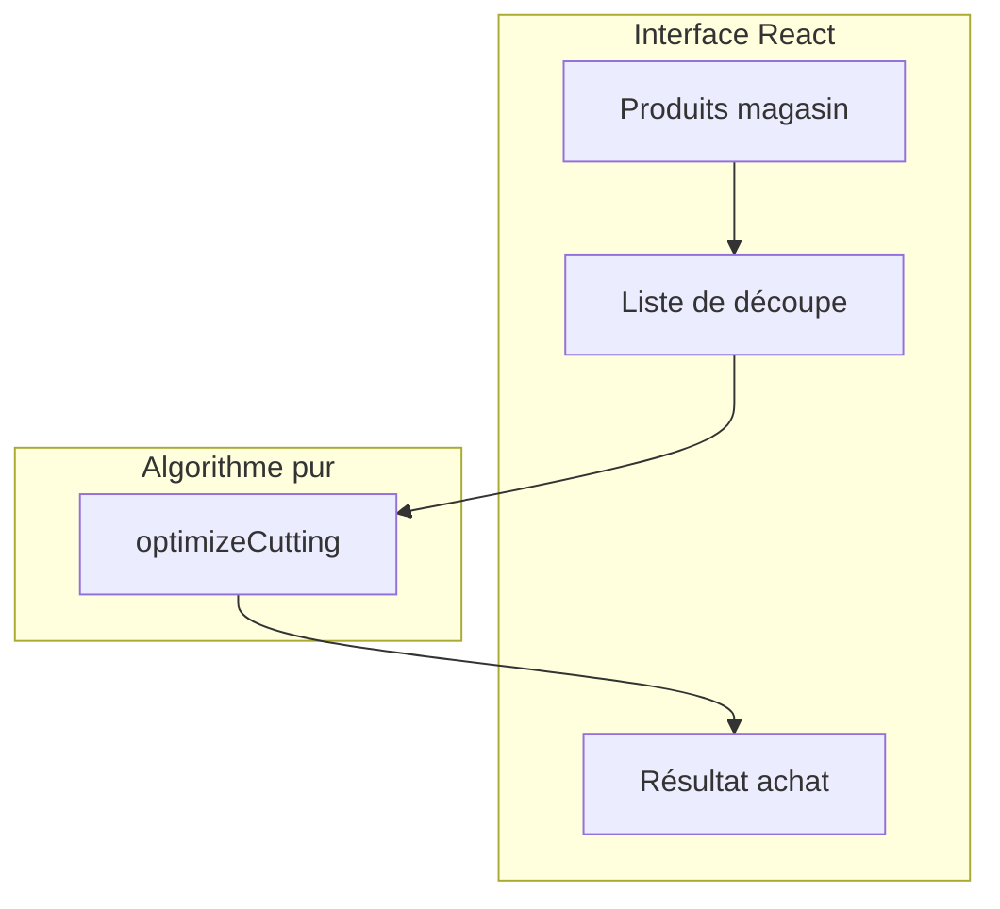

# Application Liste de courses - Planches et Chevrons

## Contexte

Projet React + TypeScript + Vite existant ([package.json](package.json), [src/App.tsx](src/App.tsx)). Tailwind v4 configuré via [@tailwindcss/vite](vite.config.ts) et [src/index.css](src/index.css). Aucune logique de découpe ni tests actuellement.

## Architecture proposée




## 1. Modèle de données

**Produit magasin** (planche ou chevron disponible) :

```ts
interface StockProduct {
  id: string;
  name: string;      // ex: "Planche 3 m"
  lengthMm: number;  // ex: 3000 (toujours en mm en interne)
}
```

**Élément de découpe** (pièce à obtenir) :

```ts
interface CutItem {
  id: string;
  lengthMm: number;
  quantity: number;
}
```

**Résultat d'optimisation** :

```ts
interface CuttingResult {
  stockProduct: StockProduct;
  stockCount: number;           // nombre de pièces à acheter
  cuts: Array<{ lengthMm: number; quantity: number }>;  // répartition par planche
  wasteMm: number;              // chute totale
}
```

## 2. Algorithme de découpe (First Fit Decreasing)

**Principe** : tri des pièces par longueur décroissante, placement dans la première planche où la pièce rentre. Borne théorique : 11/9 × OPT + 6/9 planches.

**Fichier** : `src/lib/cuttingOptimizer.ts`

- **Entrée** : `stockLengthMm`, `pieces: Array<{ lengthMm, quantity }>`, `kerfMm` (optionnel, défaut 0)
- **Sortie** : `{ stockCount, cuts, wasteMm }`
- **Logique** :
  1. Flatten : `[100, 1500, 1000]` × quantités → liste ordonnée décroissante
  2. Pour chaque pièce : chercher la première planche avec `remaining >= pieceLength + kerf`
  3. Si aucune : ouvrir nouvelle planche
  4. Mettre à jour `remaining` et enregistrer la coupe

**Paramètre kerf** : épaisseur de coupe (souvent 3–4 mm). Optionnel dans l’UI, défaut 0.

## 3. Structure des fichiers

```
src/
├── lib/
│   └── cuttingOptimizer.ts    # Algorithme pur (export optimizeCutting)
├── components/
│   ├── StockProductForm.tsx   # Saisie produits magasin (nom, longueur) — Tailwind
│   ├── CutListForm.tsx        # Saisie liste découpe (longueur, quantité) — Tailwind
│   ├── CuttingResult.tsx      # Affichage résultat (nb à acheter, détail) — Tailwind
│   └── LengthInput.tsx        # Input longueur (m/cm) → mm — Tailwind
├── hooks/
│   └── useCuttingOptimizer.ts # Appel optimizeCutting, gestion état
├── types.ts                   # Interfaces
├── App.tsx                    # Orchestration
└── ...
```

## 4. Interface utilisateur

**Styles** : Tailwind v4 uniquement. Tous les composants utilisent des classes utilitaires (`flex`, `gap-4`, `rounded-lg`, `border`, `px-4`, etc.). Pas de fichier CSS personnalisé ni de variables CSS custom pour le layout.

**Sections** :

1. **Produits du magasin** : formulaire pour ajouter planches/chevrons (nom, longueur en m ou cm)
2. **Liste de découpe** : pour chaque produit, liste de (longueur, quantité) à découper
3. **Résultat** : pour chaque produit, nombre de pièces à acheter + détail des coupes

**UX** :

- Unité unique : mètres (ex : 3, 1.5, 0.1) avec conversion interne en mm
- Option kerf : champ numérique optionnel (mm)
- Bouton "Calculer" pour lancer l’optimisation

## 5. Tests Vitest

**Configuration** :

- Ajouter `vitest` et `@vitest/coverage-v8` en devDependencies
- Script `"test": "vitest"` et `"test:run": "vitest run"`
- `vitest.config.ts` avec `include: ['src/**/*.test.ts']`

**Fichier** : `src/lib/cuttingOptimizer.test.ts`

**Cas de test** :

- Exemple utilisateur : 10 cm, 1 m, 1,50 m → 2 planches de 3 m
- Cas trivial : 1 pièce de 2 m dans planche 3 m → 1 planche
- Cas limite : pièces exactement égales à la planche
- Cas avec quantités : 4 × 1 m dans planche 3 m → 2 planches
- Cas kerf : avec épaisseur de coupe, vérifier que le nombre de planches augmente si nécessaire
- Cas vide : liste vide → 0 planche

## 6. Dépendances à ajouter

```json
"devDependencies": {
  "vitest": "^3.x",
  "@vitest/coverage-v8": "^3.x"
}
```

## 7. Points d’attention

- **Unités** : stockage en mm pour éviter les erreurs de flottants
- **Validation** : longueur de pièce ≤ longueur planche, quantités > 0
- **Performance** : FFD en O(n log n) pour le tri + O(n × k) pour le placement (k = nombre de planches), suffisant pour des listes de quelques dizaines de pièces
- **Styles** : Tailwind uniquement — pas de `App.css` ni de classes custom ; réutiliser `@theme` dans [index.css](src/index.css) si besoin de tokens (couleurs, espacements) propres au projet
